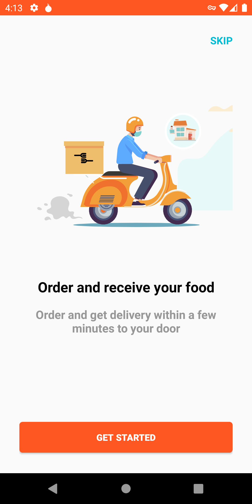
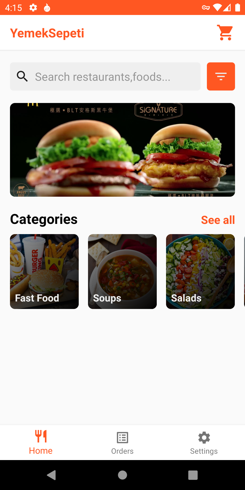
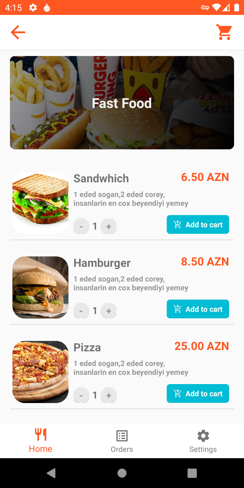
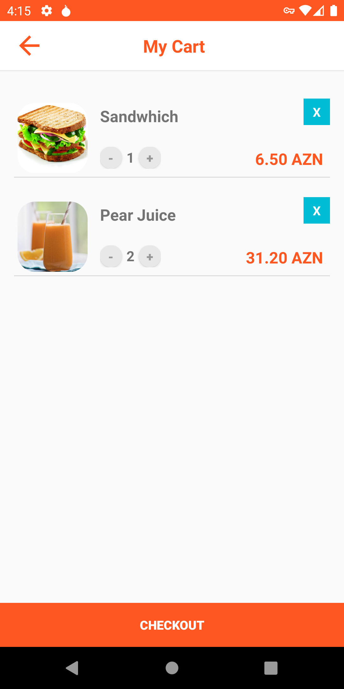
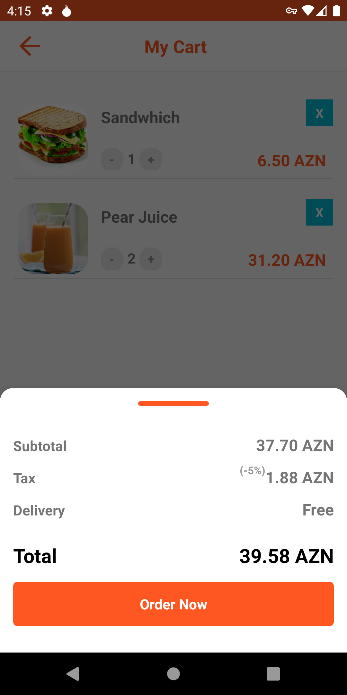

:fire: A food order app.

<h3>Technologies i used</h3>
<ul>
  <li>Kotlin</li>
  <li>MVVM Architecture</li>
  <li>Dagger Hilt</li>
  <li>Jetpack Navigation</li>
  <li>Cloud Firestore</li>
</ul>

<table>
  <tr>
     <td>Welcome Page</td>
     <td>Signup,login page</td>
     <td>Home page</td>
  </tr>
  <tr>
    <td valign="top"></td>
    <td valign="top"></td>
    <td valign="top"></td>
  </tr>
 
  <tr>
    <td>Foods page</td>
    <td>Basket page</td>
    <td>Checkout</td>
  </tr>
  
  <tr>
    <td valign="top"></td>
    <td valign="top"></td>
    <td valign="top"></td>
  </tr>
 
 
 </table>

