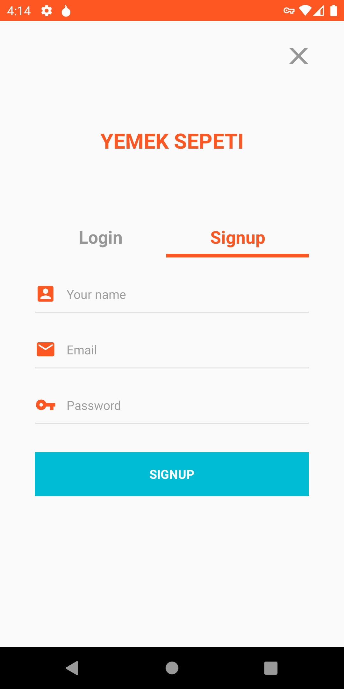

A food order app.

<h3>Technologies i used</h3>
<ul>
  <li>Kotlin</li>
  <li>MVVM Architecture</li>
  <li>Dagger Hilt</li>
  <li>Jetpack Navigation</li>
  <li>Cloud Firestore</li>
</ul>

<table>
  <tr>
     <td>Sign up or login</td>
     <td>See last messages</td>
     <td>See all users</td>
     <td>Messaging</td>
     <td>Profile and logout</td>
     <td>Profile and logout</td>
  </tr>
  <tr>
    <td valign="top"></td>
    <td valign="top"></td>
    <td valign="top"></td>
    <td valign="top"></td>
    <td valign="top"></td>
    <td valign="top"></td>
  </tr>
 </table>

